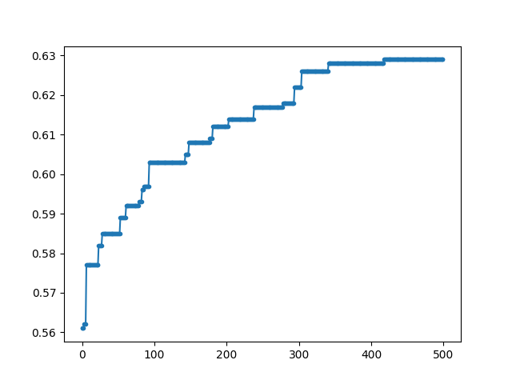
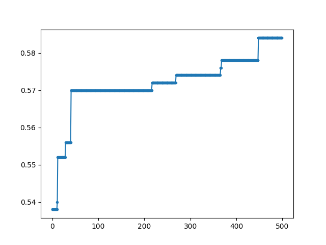
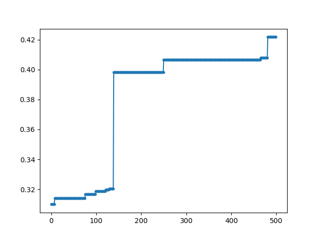
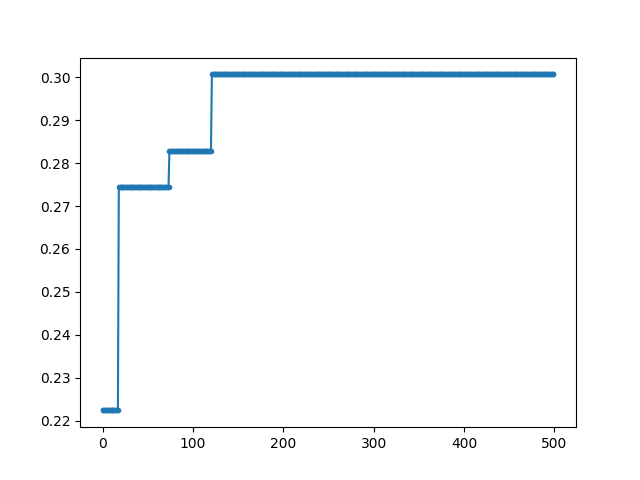
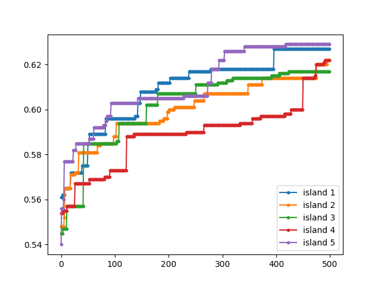
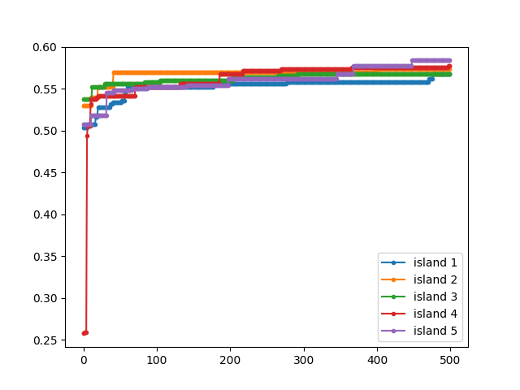
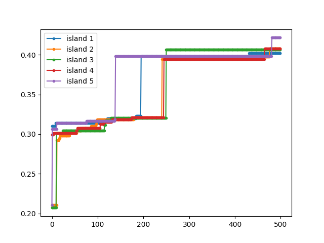
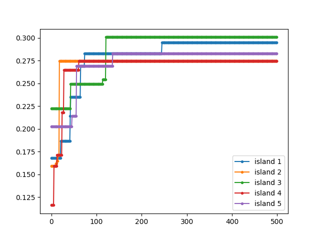

# LAB9 ASSIGNMENT

The purpose of the lab was to write a local-search algorithm (eg. an EA) able to solve the *Problem* instances 1, 2, 5, and 10 on a 1000-loci genomes, using a minimum number of fitness calls. The problem was a black box.

### APPROACH

- Try two type of crossover: `two_point_crossover` seems to perform better
- Tournament selection
- Five island with population size of 50
- Extintion: in this case I delete the duplicate elements and create some new ones, if not possible I delete some random element
- Elitism
- Considering the percentage of overlappping between the two parents to decide the action (mutation or crossover)

My results for the problem are in these graphs:
- General results:
    - problem size: 1

    

    - problem size: 2

    

    - problem size: 5

    

    - problem size: 10

    

- Results for each islands:
    - problem size: 1

    

    - problem size: 2

    

    - problem size: 5

    

    - problem size: 10

    

    

